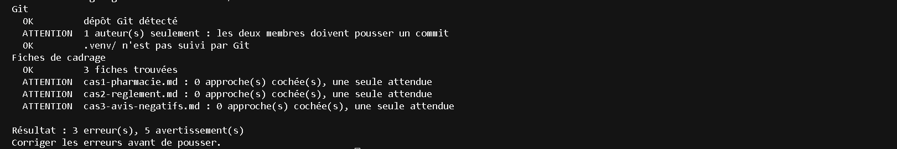

+# sentiment-app : dépôt du binôme

Application fil rouge du cours *Développement et déploiement d'applications intelligentes*.
Ce dépôt grandit chaque semaine ; la semaine 1 met en place le cadrage et l'environnement. Rien n'est jeté.

## Démarrage rapide

```bash
python -m venv .venv
source .venv/bin/activate        # Windows PowerShell : .venv\\Scripts\\Activate.ps1
pip install -r requirements.txt
```

Puis vérifiez :

```bash
python scripts/check_setup.py
pytest -q
```

## Captures des tests

### Avant correction

Cette capture montre l'état initial du diagnostic : les dépendances Python ne sont pas encore installées et les trois fiches de cadrage ne contiennent pas encore d'approche cochée.



## Membres du binôme

| Rôle | Nom | Identifiant GitHub | Travail de la semaine 1 |
| --- | --- | --- | --- |
| Membre A | Othmane Moussawi | @OthmaneW37 | Cadrage des trois cas et préparation de l'environnement |
| Membre B | Ahmed Rayane Ramzi | @RayaneRZ24  | Cadrage des trois cas et préparation de l'environnement |
